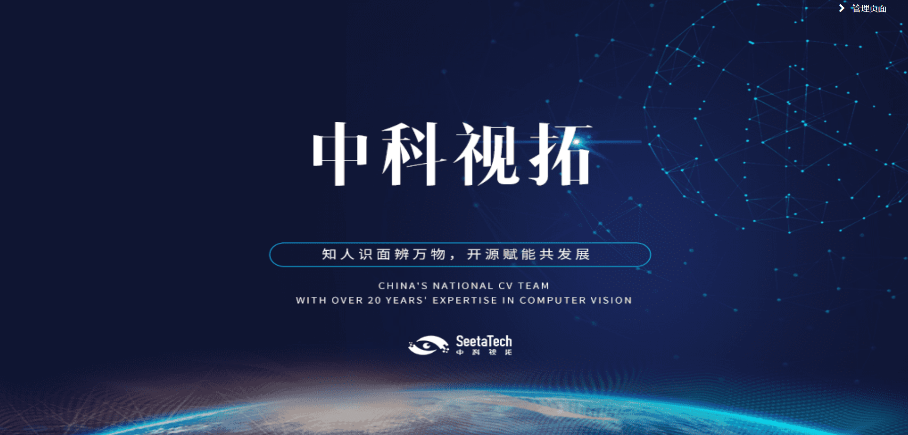

# 中科视拓设备管理平台社区版
中科视拓设备管理平台社区版，是基于中科视拓设备管理平台开发的统一管理识别设备的人脸识别应用系统。

**系统构成：**
- [前端web](https://github.com/SeetaFaceEnv/AccessControlWeb)
- [后端服务](https://github.com/SeetaFaceEnv/SeetaAccessControl)

**系统功能简介:**
- 系统信息
  - 系统配置【调整设备管理平台相关配置】
  - 管理员管理【管理系统管理员】
- 人员信息
  - 人员管理【管理人员基础信息、底库信息及所属设备组】
- 设备信息
  - 设备组【设备组包含设备】
  - 未知设备【设备管理平台发现的未知设备】
  - 设备管理【管理设备添加、编辑、样式、开门、测试、重载等】
  - 样式管理【统一管理上传的设备样式】
  - 时间模板管理【统一管理设备允许通行时间的模板】
- 记录日志
  - 通行记录【查看通行记录】
  - 设备日志【查看设备日志】
  - 访问日志【查看设备管理平台接口调用日志】
  - 照片日志【查看设备管理平台照片注册日志】
- 识别展示【实时展示识别通过后的人员照片】

**系统展示:**

图 0-1 登录页面

图 0-2 管理页面

图 0-3 识别展示

##  1、系统部署架构图

图 1-1 系统部署架构图

中科视拓智慧园区社区版服务不会直接操作硬件设备，而是通过调用中科视拓设备硬件平台接口来操作硬件设备

[中科视拓硬件设备平台](https://github.com/SeetaFaceEnv/SeetaDevice)

## 2、部署文档
智慧园区社区版部署文档请参考： [部署文档](./deployment.md)

## 3、用户手册
智慧园区社区版用户手册请参考： [用户手册](./设备管理平台_社区版_用户手册.pdf)

## 4. 开发者社区
## 4.1 代码贡献
`master`分支提供稳定版本代码。

欢迎开发者贡献优质代码，所有开发者代码需提交在`develop`分支。

## 5. 开源协议
 中科视拓智慧园区社区版依照 [BSD 2-Clause license](LICENSE) 开源。
