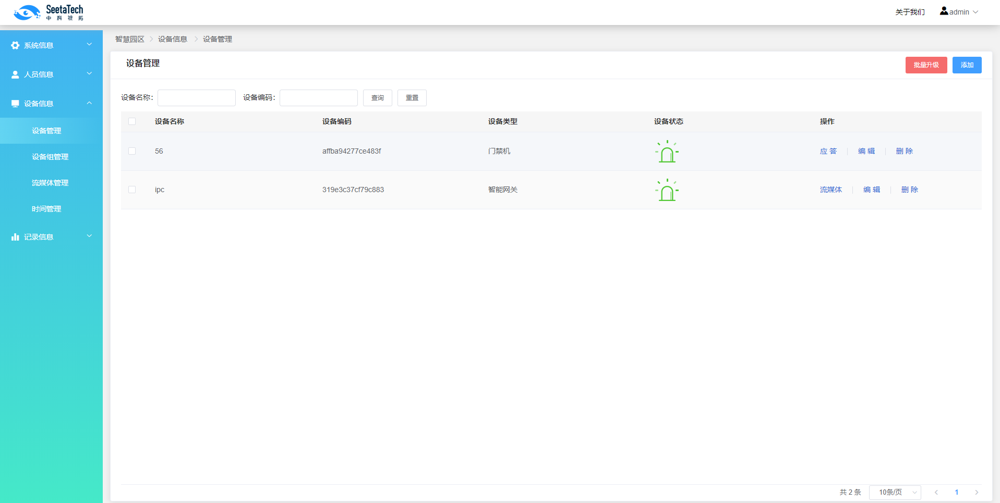
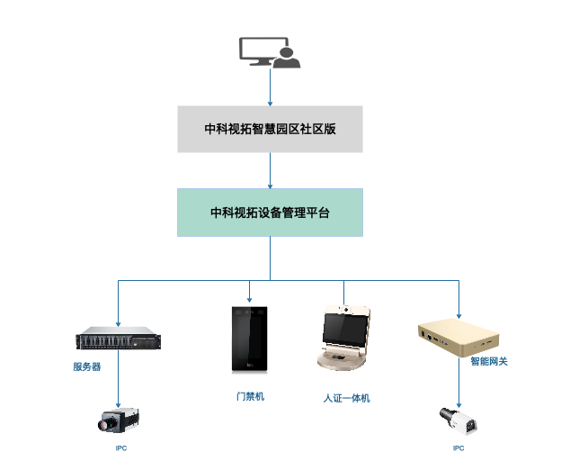

# 中科视拓智慧园区社区版
中科视拓智慧园区社区版，是基于中科视拓设备管理平台开发的人脸识别应用系统。

**系统构成：**
- [前端web](https://github.com/SeetaFaceEnv/AccessControlWeb)
- [后端服务](https://github.com/SeetaFaceEnv/SeetaAccessControl)

**系统功能简介:**
- 系统信息
  - 系统配置
    调整系统级相关参数配置·
- 人员信息
  - 字段管理
  灵活配置人员属性信息
  - 人员管理
  管理人员、照片等信息，并控制人员可识别的设备、设备组
- 设备信息
  - 设备管理
    自动发现未知设备以供添加，管理所有已知设备及相关参数信息
  - 设备组管理
    设备组统一管理组内设备
  - 流媒体管理
    管理外部rtsp流及相关参数设置
  - 时间模板管理
    统一管理设备允许通行时间的模板
- 记录信息
  - 通行记录
    查看、导出、统计（每日最早及最晚）通行记录
  - 日志记录
  查看日志记录 

**系统展示:**

图 0-1 登录页面

图 0-2 管理页面

图 0-3 识别展示

##  1、系统部署架构图

图 1-1 系统部署架构图

中科视拓智慧园区社区版服务不会直接操作硬件设备，而是通过调用中科视拓设备硬件平台接口来操作硬件设备

[中科视拓硬件设备平台](https://github.com/SeetaFaceEnv/SeetaDevice)

## 2、部署文档
智慧园区社区版部署文档请参考： [部署文档](./doc/deployment.md)

## 3、用户手册
智慧园区社区版用户手册请参考： [用户手册](./doc/manual.md)

## 4. 开发者社区
## 4.1 代码贡献
`master`分支提供稳定版本代码。

欢迎开发者贡献优质代码，所有开发者代码需提交在`develop`分支。

## 5. 开源协议
 中科视拓智慧园区社区版依照 [BSD 2-Clause license](LICENSE) 开源。
